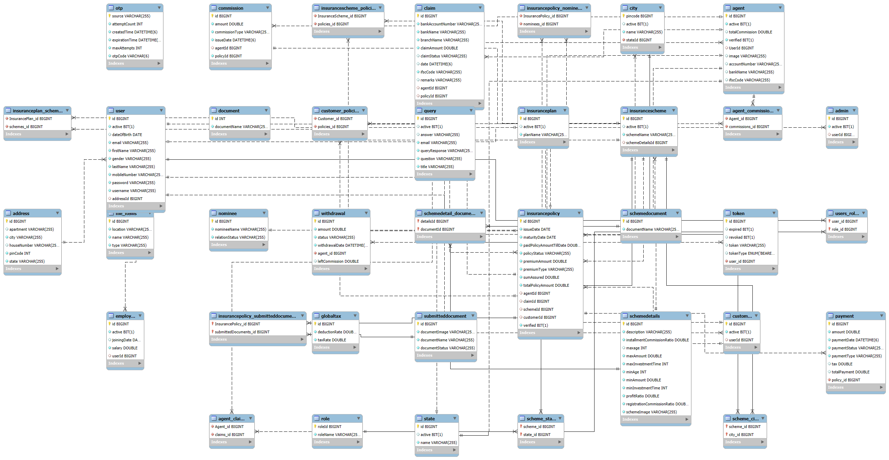

<h1>FortuneLife Insurance Application</h1>

<strong>FortuneLife Application</strong> is a comprehensive life insurance management platform built using React for the frontend and a well-structured relational database for data management. This application provides an all-in-one solution for managing insurance policies, payments, customer information, claims, commissions, and much more.

<h2>Table of Contents</h2>
<ul>
  <li><a href="#features">Features</a></li>
  <li><a href="#project-structure">Project Structure</a></li>
  <li><a href="#database-structure">Database Structure</a></li>
  <li><a href="#technologies-used">Technologies Used</a></li>
  <li><a href="#installation">Installation</a></li>
  <li><a href="#usage">Usage</a></li>
  <li><a href="#components-breakdown">Components Breakdown</a></li>
  <li><a href="#scripts">Scripts</a></li>
</ul>

<h2 id="features">Features</h2>
<ul>
  <li><strong>Admin Dashboard</strong>: A comprehensive admin dashboard to manage customers, agents, insurance schemes, settings, claims, commissions, and reports. It provides a centralized view of all application data.</li>
  <li><strong>Payment Processing</strong>: Securely handle payments for various insurance policies, integrated with third-party payment APIs (e.g., Stripe) to ensure seamless and real-time transactions.</li>
  <li><strong>Dynamic Forms</strong>: Forms for adding and managing employees, agents, customers, policies, and schemes. The dynamic nature of these forms includes validations and conditional rendering based on user input.</li>
  <li><strong>Reporting</strong>: Generate detailed reports on customers, agents, commissions, claims, and policies, aiding in business analytics and decision-making.</li>
  <li><strong>Location Management</strong>: Ability to manage cities and states for insurance policies, allowing region-based policy management and availability.</li>
  <li><strong>Document Management</strong>: Upload and manage various documents related to insurance policies, claims, and schemes, ensuring a smooth documentation process for both customers and administrators.</li>
  <li><strong>Secure User Authentication</strong>: Implements secure login, registration, and role-based access control, ensuring only authorized users can access specific features.</li>
</ul>

<h2 id="project-structure">Project Structure</h2>

The project is organized into multiple directories and files, each serving a specific purpose:

<pre>
FortuneLife-Application-master/
│
├── FortuneLife-frontend/fortune-life-app/
│   ├── public/                     # Static files such as index.html, manifest.json
│   ├── src/                        # Main source directory containing React components and utilities
│   │   ├── components/             # Directory for all the React components
│   │   │   ├── Payment/            # Components related to payment processing (e.g., Payment.js, PolicyPaymentDetails.js)
│   │   │   ├── adminDashboard/     # Admin dashboard components
│   │   │   │   ├── addEmployeeOrAgent/  # Components to add employees or agents
│   │   │   │   ├── agentReport/    # Components for generating agent reports
│   │   │   │   ├── claimApproval/  # Components for approving or rejecting insurance claims
│   │   │   │   ├── commissionSettings/  # Components for managing agent commissions
│   │   │   │   ├── manageCityAndState/  # Components to manage cities and states
│   │   │   │   └── ...             # Additional components for various admin functions
│   │   ├── App.js                  # Main application component that sets up routing and layout
│   │   ├── index.js                # Entry point for the React application
│   │   └── ...                     # Other components, stylesheets, and utilities
│   ├── .gitignore                  # Specifies files and directories to be ignored by Git
│   ├── package.json                # Lists project dependencies and scripts
│   ├── README.md                   # Documentation file
│   └── ...                         # Other configuration files and directories
</pre>

<h2 id="database-structure">Database Structure</h2>

The backend is supported by a relational database designed to manage different aspects of the insurance application, including users, policies, payments, documents, and more. Here’s a detailed look at each table:

<h3>User Management</h3>
<ul>
  <li><strong>fortune_life_user</strong>: Stores general user information like username, password, and personal details. This table is central to the application as it links to roles, admin, customer, agent, and employee data.</li>
  <li><strong>fortune_life_role</strong>: Defines user roles within the application (e.g., Admin, Agent, Customer, Employee). These roles help implement role-based access control, ensuring that users have permissions based on their role.</li>
  <li><strong>fortune_life_users_roles</strong>: A join table establishing a many-to-many relationship between users and roles, allowing for flexible user-role assignments (e.g., a user can be both an agent and a customer).</li>
  <li><strong>fortune_life_admin</strong>: Contains specific information about admin users, allowing them to manage various aspects of the platform.</li>
  <li><strong>fortune_life_agent</strong>: Stores information specific to insurance agents, including their assigned commissions and associated customers.</li>
  <li><strong>fortune_life_customer</strong>: Holds customer details, including policy information, contact details, and associated documents.</li>
  <li><strong>fortune_life_employee</strong>: Maintains records for employees involved in managing customers, policies, and claims.</li>
</ul>

<h3>Insurance Policies and Plans</h3>
<ul>
  <li><strong>fortune_life_insuranceplan</strong>: Contains details of various insurance plans offered by the company. Each plan can have multiple schemes and policies associated with it.</li>
  <li><strong>fortune_life_insurancescheme</strong>: Defines different schemes under each insurance plan, outlining the terms, coverage, and benefits.</li>
  <li><strong>fortune_life_insurancepolicy</strong>: Stores information about policies purchased by customers, including policy terms, start date, and linked scheme.</li>
  <li><strong>fortune_life_nominee</strong>: Records details about nominees associated with a policy, which are critical during claim processing.</li>
  <li><strong>fortune_life_claim</strong>: Manages claims filed by customers. It contains claim details, status, and links to policies, enabling the platform to track claims from submission to resolution.</li>
  <li><strong>fortune_life_agent_claims</strong>: Tracks claims handled by agents, ensuring transparency and providing metrics on agent performance.</li>
</ul>

<h3>Payments and Financial Management</h3>
<ul>
  <li><strong>fortune_life_payment</strong>: Manages payments made for insurance policies, tracking payment methods, amounts, dates, and statuses.</li>
  <li><strong>fortune_life_commission</strong>: Contains information on commissions earned by agents, based on policy sales or customer management.</li>
  <li><strong>fortune_life_agent_commissions</strong>: Links agents with their respective commissions, facilitating clear financial management and reporting.</li>
  <li><strong>fortune_life_withdrawal</strong>: Tracks withdrawal requests made by agents or customers, potentially linked to commission payments or policy withdrawals.</li>
  <li><strong>fortune_life_globaltax</strong>: Holds global tax settings that are applied to transactions, ensuring compliance with tax regulations.</li>
</ul>

<h3>Document Management</h3>
<ul>
  <li><strong>fortune_life_document</strong>: Stores metadata about documents uploaded by users (e.g., proof of identity, address, policy documents).</li>
  <li><strong>fortune_life_submitteddocument</strong>: Links submitted documents to policies and customers, ensuring that all required paperwork is associated with policy purchases.</li>
  <li><strong>fortune_life_schemedocument</strong>: Manages documents related to insurance schemes, detailing terms, conditions, and other relevant information.</li>
  <li><strong>fortune_life_insurancepolicy_submitteddocuments</strong>: Tracks documents submitted specifically for insurance policy processing.</li>
</ul>

<h3>Geographical Data</h3>
<ul>
  <li><strong>fortune_life_city</strong>: Contains information about cities, likely used for customer addresses or location-specific policy management.</li>
  <li><strong>fortune_life_state</strong>: Similar to the city table but for states, providing geographical context to insurance operations.</li>
  <li><strong>fortune_life_scheme_city</strong> &amp; <strong>fortune_life_scheme_state</strong>: Links insurance schemes to specific cities or states, allowing for regional availability of insurance products.</li>
</ul>

<h3>Security and Verification</h3>
<ul>
  <li><strong>fortune_life_otp</strong>: Stores OTPs (One-Time Passwords) for user verification, enhancing security during registration, login, or sensitive operations like password resets.</li>
  <li><strong>fortune_life_token</strong>: Manages tokens for user sessions, used for secure authentication and API access.</li>
</ul>

<h3>Miscellaneous</h3>
<ul>
  <li><strong>fortune_life_query</strong>: Tracks customer or agent queries, facilitating customer support and interaction management.</li>
  <li><strong>fortune_life_address</strong>: Stores address information for users or policies, linked to the customer, agent, or employee data.</li>
  <li><strong>fortune_life_file_items</strong>: Likely manages uploaded files, linking them to documents, policies, or other relevant data within the platform.</li>
</ul>

<h2 id="technologies-used">Technologies Used</h2>
<ul>
  <li><strong>Frontend</strong>: React, JavaScript</li>
  <li><strong>Styling</strong>: CSS for custom component styling</li>
  <li><strong>API Integration</strong>: Presumed use of Axios for HTTP requests (e.g., for payment processing)</li>
  <li><strong>Database</strong>: SQL-based relational database, with tables for user management, policies, payments, and more.</li>
</ul>

<h2 id="installation">Installation</h2>

To run the application locally, follow these steps:

<ol>
  <li><strong>Clone the Repository</strong>:
    <pre><code>git clone https://github.com/ShankarHalemani/FortuneLife-Application.git</code></pre>
  </li>
  <li><strong>Start the Backend</strong>:
    <ol>
      <li><strong>Import the Backend Project</strong>:
        
Open Eclipse or IntelliJ IDEA and import the <code>FortuneLife-backend</code> project as a Maven project.

      </li>
      <li><strong>Build and Run the Project</strong>:
        
Build the project and run the application by executing the <code>Application.java</code> file.

      </li>
      <li><strong>Configure Application Properties</strong>:
        
If necessary, modify the port settings in the <code>application.properties</code> file.

      </li>
    </ol>
  </li>
  <li><strong>Start the Frontend</strong>:
    <ol>
      <li><strong>Navigate to the Frontend Directory</strong>:
        <pre><code>cd FortuneLife-Application-master/FortuneLife-frontend/fortune-life-app</code></pre>
      </li>
      <li><strong>Install Dependencies</strong>:
        <pre><code>npm install</code></pre>
      </li>
      <li><strong>Run the Application</strong>:
        <pre><code>npm start</code></pre>
      </li>
    </ol>
  </li>
</ol>

<h2 id="usage">Usage</h2>
<ul>
  <li><strong>Start the Application</strong>: Run <code>npm start</code> to launch the application. Access it at <code>http://localhost:3000</code>. Ensure the backend is running to handle API requests.</li>
  <li><strong>Admin Dashboard</strong>: Navigate to manage users, policies, payments, claims, commissions, and reports.</li>
  <li><strong>Payments</strong>: Use the payment components to handle policy transactions. Integrates with external APIs for processing.</li>
  <li><strong>Reports</strong>: Generate reports to analyze customer data, policy performance, and agent activity.</li>
</ul>

<h2 id="components-breakdown">Components Breakdown</h2>

The application consists of various components such as:

<ul>
  <li><strong>Admin Dashboard</strong>: Main interface for admins to manage the application.</li>
  <li><strong>Payment Components</strong>: Handle payment processing and displaying payment details.</li>
  <li><strong>Forms</strong>: Dynamic forms for adding and managing employees, agents, and customers.</li>
  <li><strong>Claim Approval</strong>: Tools for processing and approving claims.</li>
</ul>

<h2 id="scripts">Scripts</h2>
<ul>
  <li><code>npm start</code>: Runs the app in development mode.</li>
  <li><code>npm test</code>: Launches the test runner.</li>
  <li><code>npm run build</code>: Builds the app for production.</li>
</ul>

<h2>Database Schema Design</h2>

